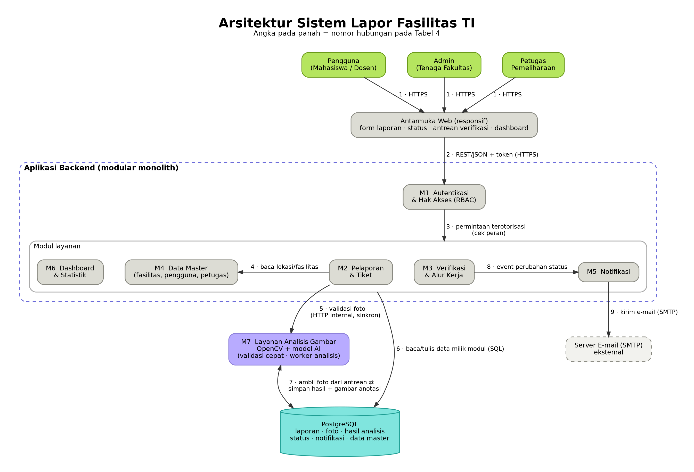

# Dokumen Desain Sistem — Minggu 6

## Layanan Pelaporan Fasilitas Rusak ("Lapor Fasilitas TI")

| | |
|---|---|
| **Mata kuliah** | Rekayasa Perangkat Lunak — 3D TI 25 |
| **Program studi** | Teknik Informatika, Fakultas Sains dan Teknologi, UIN Syarif Hidayatullah Jakarta |
| **Kelompok** | Kelompok 8 |
| **Anggota** | Yafi Abhiyasa Ichsan (1251420025) · Anugrah Linson Putra Aditama (1251420027) · Muhammad Guntur Sarwoko (1251420082) · Azwar Riansyah (1251420090) |
| **Berkas** | `docs/design-week6.md` · `docs/architecture.png` · `docs/architecture.dot` (sumber diagram) |
| **Tahun** | 2026 |

---

## Ringkasan

Lapor Fasilitas TI adalah aplikasi web tempat mahasiswa dan dosen Teknik Informatika melaporkan kerusakan fasilitas (lab komputer, server, Wi-Fi, proyektor) lengkap dengan lokasi, detail, dan foto. Setiap laporan mendapat nomor tiket, diverifikasi, ditugaskan ke petugas, dan statusnya dapat dilacak pelapor.

Pembeda utama dari proses manual adalah **verifikasi kerusakan berbantuan AI**: foto divalidasi kualitasnya, dianalisis dengan OpenCV dan model AI, lalu diberi skor keparahan dan skor keyakinan. Laporan dengan keyakinan tinggi diverifikasi otomatis, sedangkan yang lain diperiksa manual oleh Admin.

Dokumen ini menjawab lima ketentuan tugas minggu 6: kebutuhan terpilih dan asumsi (Bagian 2), daftar modul (Bagian 3), diagram arsitektur dan label hubungan (Bagian 4), alur satu fitur beserta kondisi gagal (Bagian 5), dan dua keputusan desain (Bagian 6).

---

## 1. Pendahuluan

### 1.1 Latar belakang dan tujuan

Pelaporan kerusakan fasilitas Prodi Teknik Informatika saat ini manual dan tersebar. Dosen sering tidak tahu harus melapor ke mana, mahasiswa hanya mengeluh di media sosial, dan tenaga fakultas menerima informasi yang terlambat dan kurang lengkap. Akibatnya kerusakan kecil membesar, biaya perbaikan naik, praktikum terganggu, dan kepercayaan pengguna menurun.

**Tujuan sistem:** memastikan setiap kendala fasilitas segera diperbaiki sebelum bertambah parah, sehingga aktivitas berjalan lancar dan kenyamanan serta kepercayaan mahasiswa dan dosen terjaga.

<p align="center"></p>

*Gambar 1. Tujuan sistem: dari penanganan yang tersebar menjadi satu alur yang dapat dilacak.*

### 1.2 Tujuan dokumen

Dokumen ini menerjemahkan hasil analisis kebutuhan (laporan analisis kelompok dan tugas Software Analysis) menjadi rancangan: modul, arsitektur, alur fitur, dan keputusan desain yang menjadi pegangan implementasi.

---

## 2. Kebutuhan Terpilih dan Asumsi

### 2.1 Kebutuhan terpilih

Kebutuhan K1–K8 diambil dari tugas Software Analysis (Bagian C) dan ditelusuri ke fitur serta use case. K9 ditambahkan dari laporan analisis kelompok, yang menjadikan klasifikasi berbantuan AI sebagai fitur pembeda, dan digambarkan secara rinci pada alur dan pipeline di Bagian 5.

**Tabel 1. Kebutuhan terpilih**

| Kode | Kebutuhan | Aktor | Padanan MoSCoW\* | Use case terkait |
|---|---|---|---|---|
| K1 | Formulir pelaporan: pilih lokasi/fasilitas, isi detail, unggah foto | Pengguna | Must (formulir pengaduan) | Melaporkan Fasilitas Rusak |
| K2 | Nomor tiket dan pelacakan status laporan | Pengguna | Must (nomor tiket & pelacakan) | Melihat Status Laporan |
| K3 | Notifikasi perubahan status dan riwayat laporan | Pengguna | Should (notifikasi, riwayat) | Melihat Riwayat Laporan |
| K4 | Verifikasi laporan dan penetapan status Diproses/Ditolak | Admin | Must (dashboard admin) | Memverifikasi Laporan; Memperbarui Status Laporan |
| K5 | Pengelolaan data master fasilitas, pengguna, petugas | Admin | Must (dashboard admin) | Mengelola Data Fasilitas / Pengguna / Petugas |
| K6 | Penugasan ke petugas dan pembaruan hasil penanganan | Admin, Petugas | Must (dashboard admin) | Menangani Kerusakan |
| K7 | Statistik dan tren kerusakan untuk keputusan Kaprodi | Admin (penyaji), Kaprodi (penerima) | Could (statistik & grafik) | Melihat dan Mengelola Laporan |
| K8 | Login dengan hak akses sesuai peran | Semua | Must (autentikasi) | Prasyarat seluruh use case |
| K9 | Verifikasi kerusakan berbantuan AI: validasi foto, deteksi, skor, review manual | Sistem, Admin | Tidak ada di MoSCoW; diusulkan Should | Memverifikasi Laporan |

\* Padanan terdekat dengan tabel MoSCoW pada laporan analisis kelompok. K4–K6 tidak disebut satu per satu di sana, sehingga dipadankan dengan "dashboard admin".

### 2.2 Use case

<p align="center"></p>

*Gambar 2. Use case diagram Sistem Pelaporan Fasilitas Rusak.*

Tiga aktor berinteraksi dengan sistem:

- **Pengguna** (mahasiswa/dosen) melaporkan kerusakan, melihat status dan riwayat laporan, serta melihat informasi fasilitas.
- **Admin** (tenaga fakultas) mengelola data master, memverifikasi laporan, memperbarui status, dan membuat statistik.
- **Petugas** (pemeliharaan) menangani kerusakan di lapangan setelah ditugaskan.

### 2.3 Di luar cakupan iterasi ini

Sesuai kategori *Won't Have* pada laporan analisis dan catatan pada tugas Software Analysis, hal-hal berikut tidak dirancang pada iterasi ini:

- Gamifikasi dan insentif pelapor.
- Notifikasi WhatsApp, live chat real-time, dan aplikasi mobile native.
- Integrasi SSO kampus, database akademik, dan sistem manajemen aset.
- Penugasan otomatis dan eskalasi berbasis SLA (penugasan dilakukan manual oleh Admin).

### 2.4 Asumsi

**Tabel 2. Asumsi perancangan**

| Kode | Asumsi | Bila asumsi tidak terpenuhi |
|---|---|---|
| A1 | Pengguna adalah sivitas akademika satu prodi (ratusan pengguna aktif, paling banyak puluhan laporan per hari). | Beban lebih besar menuntut pemisahan komponen lebih lanjut (lihat KD-1). |
| A2 | Aplikasi berbasis web responsif yang dibuka lewat browser di HP atau laptop; kamera diakses langsung dari browser. | Aplikasi native perlu dirancang ulang (saat ini *Won't Have*). |
| A3 | Login memakai NIM/NIDN dan kata sandi. Akun Admin dan Petugas dibuat oleh Admin. SSO kampus adalah pengembangan lanjutan. | Modul M1 perlu adapter SSO. |
| A4 | PostgreSQL adalah satu-satunya basis data. Foto dan metadata disimpan di PostgreSQL sesuai alur fitur. | Bila volume foto besar, foto dipindah ke object storage tanpa mengubah modul lain. |
| A5 | Analisis AI hanya untuk kerusakan fisik yang terlihat di foto (goresan, retak, penyok). Kategori non-visual (Wi-Fi putus, PC lambat) tidak dianalisis AI dan langsung ke review manual. | Cakupan AI perlu diperluas dengan sumber data lain. |
| A6 | Skala keparahan mengikuti pipeline: **ringan, sedang, berat**. Laporan analisis menyebutnya ringan/sedang/darurat; "berat" dianggap setara "darurat". | Cukup menyamakan istilah. |
| A7 | Model AI deteksi kerusakan disiapkan oleh tim (dokumen ini tidak menetapkan arsitektur modelnya), dan akurasinya belum teruji pada foto nyata lab TI. Ambang kualitas foto dan ambang keyakinan bernilai awal yang dapat dikonfigurasi dan dikalibrasi lewat uji. | Ambang diubah tanpa mengubah kode (parameter konfigurasi). |
| A8 | "Review manual petugas" pada alur AI dilakukan oleh Admin (tenaga fakultas) sebagai verifikator. Petugas pemeliharaan menangani setelah laporan ditugaskan. | Peran verifikator dapat diberikan ke akun lain tanpa mengubah alur. |
| A9 | Notifikasi berupa pesan di dalam aplikasi dan e-mail. | WhatsApp memerlukan kanal baru (saat ini *Won't Have*). |
| A10 | Kaprodi menerima statistik yang disiapkan Admin (tampilan atau ekspor), bukan lewat akun peran tersendiri. | Peran "Pimpinan" (baca saja) dapat ditambahkan di M1. |

---

## 3. Daftar Modul dan Tanggung Jawab

Sistem terdiri atas enam modul di dalam satu aplikasi backend (M1–M6) dan satu layanan analisis gambar terpisah (M7). Aturan batas modul: setiap modul hanya menulis tabel miliknya sendiri, dan modul lain mengaksesnya lewat antarmuka modul, bukan query langsung. Satu-satunya pengecualian adalah M7 yang menulis tabel hasil analisis.

**Tabel 3. Modul dan tanggung jawab**

| Kode | Modul | Tanggung jawab | Data yang dikelola | Kebutuhan |
|---|---|---|---|---|
| M1 | Autentikasi & Hak Akses | Login/logout; verifikasi kredensial (kata sandi di-hash); penerbitan token; pemeriksaan peran (RBAC) pada setiap permintaan; pencatatan login. | Kredensial, sesi, peran | K8 |
| M2 | Pelaporan & Tiket | Menyajikan formulir; memvalidasi isian; meminta validasi foto ke M7; menyimpan laporan, foto, dan metadata; menerbitkan nomor tiket; menampilkan daftar, status, dan riwayat laporan milik pengguna. | Laporan, foto laporan | K1, K2, K3 |
| M3 | Verifikasi & Alur Kerja | Antrean verifikasi; menerapkan aturan ambang keyakinan; keputusan valid/tidak valid; mengatur transisi status; penugasan ke petugas; pembaruan hasil penanganan; mencatat riwayat status (audit trail). | Penugasan, riwayat status, keputusan verifikasi | K4, K6, K9 |
| M4 | Data Master | CRUD fasilitas (gedung, ruang, aset), pengguna, dan petugas; menyajikan informasi dan pemetaan fasilitas untuk pengguna. | Fasilitas, profil pengguna, profil petugas | K5 |
| M5 | Notifikasi | Menerima event perubahan status; menyusun pesan; menyimpan notifikasi dalam aplikasi; mengirim e-mail dengan percobaan ulang bila gagal. | Notifikasi | K3 |
| M6 | Dashboard & Statistik | Agregasi jumlah, jenis, lokasi, dan tren kerusakan; filter dan pencarian laporan; ekspor ringkasan untuk Kaprodi. Hanya membaca data. | (kueri agregasi, tanpa tabel sendiri) | K7 |
| M7 | Layanan Analisis Gambar | Endpoint validasi cepat kualitas foto; worker yang mengambil foto dari antrean, menjalankan pipeline OpenCV + model AI, menghitung skor keparahan dan skor keyakinan, lalu menyimpan hasil dan gambar anotasi. | Hasil analisis | K9 |

Komponen pendukung di luar modul: **Antarmuka Web** (tampilan untuk ketiga peran), **PostgreSQL** (basis data), dan **Server E-mail** (SMTP eksternal).

---

## 4. Arsitektur dan Label Hubungan



*Gambar 3. Arsitektur sistem. Berkas: `docs/architecture.png`; sumber: `docs/architecture.dot`.*

### 4.1 Gaya arsitektur

Arsitektur berlapis dengan tiga bagian utama:

1. **Antarmuka Web** yang diakses ketiga aktor lewat HTTPS.
2. **Aplikasi backend berbentuk *modular monolith***: satu unit yang di-deploy, berisi modul M1–M6 dengan batas yang jelas. M1 berfungsi sebagai gerbang, sehingga semua permintaan ke M2, M3, M4, dan M6 sudah melewati pemeriksaan peran.
3. **Layanan Analisis Gambar (M7)** yang berjalan terpisah karena beban komputasinya berat dan berkarakter berbeda. M7 berkomunikasi dengan backend lewat dua cara: panggilan HTTP internal untuk validasi foto yang cepat, dan antrean di PostgreSQL untuk analisis yang lebih lama.

### 4.2 Label hubungan

Nomor pada tabel sama dengan nomor pada panah di Gambar 3.

**Tabel 4. Hubungan antarkomponen**

| No | Dari → Ke | Label | Sifat | Data yang mengalir |
|---|---|---|---|---|
| 1 | Pengguna / Admin / Petugas → Antarmuka Web | HTTPS | Sinkron | Halaman, formulir, foto |
| 2 | Antarmuka Web → M1 | REST/JSON + token (HTTPS) | Sinkron | Kredensial, token, permintaan |
| 3 | M1 → M2, M3, M4, M6 | Permintaan terotorisasi (cek peran) | Sinkron | Permintaan yang sudah lolos RBAC |
| 4 | M2 → M4 | Baca lokasi/fasilitas | Sinkron (antarmuka modul) | Daftar gedung, ruang, aset |
| 5 | M2 → M7 | Validasi foto (HTTP internal) | Sinkron | Foto; hasil lolos/tidak beserta alasan |
| 6 | Modul layanan → PostgreSQL | Baca/tulis data milik modul (SQL) | Sinkron | Laporan, foto, status, penugasan, notifikasi, data master |
| 7 | M7 ⇄ PostgreSQL | Ambil foto dari antrean ⇄ simpan hasil + gambar anotasi | Asinkron (worker) | Foto; jenis, lokasi, ukuran, skor, gambar anotasi |
| 8 | M3 → M5 | Event perubahan status | Asinkron ringan | ID laporan, status baru, penerima |
| 9 | M5 → Server E-mail | Kirim e-mail (SMTP) | Asinkron, dengan percobaan ulang | Pesan pemberitahuan |

---

## 5. Alur Satu Fitur: Pelaporan dengan Verifikasi Kerusakan Berbantuan AI

Fitur ini dipilih karena melibatkan hampir semua modul (M1–M5 dan M7), merupakan pembeda utama sistem, dan memiliki kondisi gagal yang nyata.

### 5.1 Alur dan pipeline

<p align="center"></p>

*Gambar 4. Alur fitur pengecekan kerusakan dengan AI. Cabang "Tidak" pada validasi foto adalah kondisi gagal utama.*

Langkah "Analisis OpenCV + model AI" pada Gambar 4 dijalankan oleh M7 dengan tahapan berikut:

<p align="center"></p>

*Gambar 5. Pipeline OpenCV untuk verifikasi kerusakan.*

Keluaran pipeline ada dua nilai dengan fungsi berbeda:

- **Skor keparahan** menentukan kelas ringan, sedang, atau berat (informasi untuk Admin dan petugas).
- **Skor keyakinan** menentukan apakah laporan boleh diverifikasi otomatis atau harus diperiksa manual.

### 5.2 Langkah jalur normal

**Tabel 5. Jalur normal (foto lolos validasi, keyakinan tinggi)**

| No | Pelaku / modul | Aksi | Hubungan (Tabel 4) |
|---|---|---|---|
| 1 | Pengguna, M1 | Login; sistem menerbitkan token berisi peran Pengguna. | 1, 2 |
| 2 | Pengguna, M2, M4 | Membuka formulir; M2 mengambil daftar lokasi/fasilitas dari M4; pengguna memilih lokasi, mengisi kategori dan deskripsi, lalu memilih foto. | 3, 4 |
| 3 | M2 → M7 | M2 mengirim foto ke M7 untuk validasi kualitas (resolusi, ketajaman, pencahayaan). | 5 |
| 4 | M2 | Foto lolos: laporan, foto, dan metadata disimpan dalam satu transaksi; nomor tiket terbit; status **Baru Diterima**; laporan ditandai menunggu analisis. Pengguna langsung melihat nomor tiket tanpa menunggu AI. | 6 |
| 5 | M7 | Worker mengambil foto dari antrean dan menjalankan pipeline (Gambar 5). Kategori non-visual (asumsi A5) melewati langkah 5–7 dan langsung ke review manual. | 7 |
| 6 | M7 | Menyimpan hasil: jenis kerusakan, lokasi, ukuran, skor keparahan, kelas, skor keyakinan, dan gambar anotasi. | 7 |
| 7 | M3 | Membandingkan skor keyakinan dengan ambang. | 6 |
| 8a | M3 | Keyakinan **tinggi**: verifikasi otomatis; status menjadi **Diverifikasi** dengan penanda "diverifikasi otomatis". | 6 |
| 8b | Admin, M3 | Keyakinan **rendah**: laporan masuk antrean review manual; Admin memeriksa foto dan gambar anotasi lalu memutuskan valid (**Diverifikasi**) atau tidak valid (**Ditolak** beserta alasan). | 6 |
| 9 | M3 | Mencatat riwayat status dan mengirim event ke M5. | 6, 8 |
| 10 | M5 | Menyimpan notifikasi dalam aplikasi dan mengirim e-mail ke pelapor. | 6, 9 |
| 11 | Pengguna | Melihat hasil di halaman Status Laporan. | 2, 3 |

Setelah **Diverifikasi**, Admin menugaskan petugas (status **Diproses**), petugas menangani dan melaporkan hasilnya (status **Selesai**). Setiap perubahan status memicu notifikasi (Gambar 6).

<p align="center"></p>

*Gambar 6. Siklus status laporan. "Diverifikasi" berarti laporan sudah diperiksa dan valid, menunggu penugasan. "Diproses" berarti sudah ditugaskan dan sedang ditangani, sesuai use case "Diproses (jika valid)".*

### 5.3 Kondisi gagal

**Tabel 6. Kondisi gagal pada fitur ini**

| Kode | Kondisi | Respons sistem | Hasil |
|---|---|---|---|
| **F1 (utama)** | **Foto tidak lolos validasi** (buram, terlalu gelap/terang, atau resolusi terlalu rendah) | Laporan belum disimpan dan belum ada tiket. Sistem menampilkan alasan yang spesifik (misalnya "foto terlalu buram") beserta saran, mempertahankan semua isian formulir, dan meminta pengguna mengunggah ulang (cabang "Tidak" pada Gambar 4). Setelah 3 kali gagal berturut-turut, muncul tombol **Kirim tetap**: laporan disimpan dengan penanda "foto kualitas rendah" dan langsung ke review manual. | Pengguna tidak kehilangan data, kualitas masukan AI terjaga, dan laporan mendesak tidak terhambat. |
| F2 | Skor keyakinan rendah | Laporan tetap tersimpan dan masuk antrean review manual Admin, lengkap dengan gambar anotasi (Gambar 4, cabang "Tidak" pada keyakinan). | Keputusan akhir ada di manusia. |
| F3 | M7 tidak tersedia, timeout, atau galat saat analisis | Saat unggah: laporan tetap diterima dengan penanda "validasi dilewati". Saat analisis: pekerjaan diulang beberapa kali (nilai awal 3); bila tetap gagal, ditandai gagal dan dialihkan ke review manual. | Aplikasi utama tetap berjalan walau AI bermasalah. |

---

## 6. Dua Keputusan Desain

### KD-1. Modular monolith dengan satu PostgreSQL; hanya analisis gambar yang dipisah

**Keputusan.** Modul M1–M6 dibangun dalam satu aplikasi backend yang di-deploy sebagai satu unit, dengan batas modul yang tegas, dan seluruh data disimpan di satu PostgreSQL. Hanya Layanan Analisis Gambar (M7) yang dijalankan sebagai proses terpisah.

**Alasan.**

1. **Skala kecil.** Sistem melayani satu prodi (A1) dan dikerjakan tim empat orang dalam waktu perkuliahan. Biaya deploy, komunikasi antarlayanan, dan pemantauan banyak layanan tidak sebanding dengan manfaatnya.
2. **Kebutuhan modularitas tetap terpenuhi.** Kebutuhan non-fungsional meminta arsitektur modular yang mudah menambah kanal. Batas modul, antarmuka modul, dan kepemilikan tabel sudah memberi hal itu tanpa memisahkan proses.
3. **Konsistensi data.** Dengan satu basis data, pembuatan tiket, penyimpanan foto, dan pendaftaran antrean analisis dapat dibuat dalam satu transaksi. Statistik dan audit trail juga lebih mudah karena data berada di satu tempat.
4. **M7 dipisah karena karakternya berbeda.** Pemrosesan gambar memakan CPU, memerlukan pustaka OpenCV dan model AI, serta bisa lambat atau gagal. Bila berada dalam proses yang sama, dashboard akan melambat dan galat di M7 dapat menjatuhkan seluruh aplikasi. Pemisahan ini mendukung kebutuhan performa dan keandalan.

**Alternatif yang ditolak.**

- *Microservices penuh*: kompleksitas operasional tinggi untuk skala satu prodi.
- *Semua dalam satu proses, termasuk AI*: dashboard melambat dan satu galat AI mempengaruhi semua fitur.
- *Basis data terpisah (misalnya NoSQL untuk foto dan hasil)*: dua teknologi untuk dirawat, dan konsistensi antardata lebih sulit dijaga.

**Konsekuensi dan mitigasi.**

- PostgreSQL menjadi titik tunggal kegagalan, sehingga dibutuhkan backup rutin (sesuai kebutuhan keandalan).
- Menyimpan foto di basis data membuatnya cepat membesar; bila perlu, foto dipindah ke object storage (A4) tanpa mengubah modul lain.
- Batas modul hanya terjaga bila ditegakkan dalam code review: modul tidak boleh membaca tabel modul lain secara langsung.

### KD-2. AI sebagai pemberi rekomendasi, dengan ambang keyakinan dan review manual

**Keputusan.** Hasil AI tidak menggantikan keputusan manusia. Aturannya:

- Keyakinan **tinggi** → laporan boleh **diverifikasi otomatis**.
- Keyakinan **rendah**, kategori non-visual, atau AI gagal → **review manual** oleh Admin.
- AI **tidak pernah menolak** laporan secara otomatis.
- Admin dapat **menimpa** hasil AI kapan saja, dan setiap penimpaan dicatat.
- Analisis berjalan **asinkron**: pengguna menerima nomor tiket segera, hasil menyusul.

**Alasan.**

1. **Model belum teruji** pada foto nyata lab TI (A7), sehingga kesalahan harus dianggap mungkin terjadi.
2. **Dampak kesalahan tidak simetris.** Verifikasi otomatis yang keliru hanya perlu ditimpa Admin, sedangkan penolakan otomatis yang keliru membuat kerusakan nyata diabaikan dan pelapor kehilangan kepercayaan. Karena itu AI hanya boleh menerima, tidak menolak.
3. **Cakupan AI terbatas** pada kerusakan fisik yang terlihat (A5). Gangguan seperti Wi-Fi putus tidak dapat dinilai dari foto.
4. **Selaras dengan analisis kebutuhan**, yang menyebut AI memberi rekomendasi awal dan petugas mengonfirmasi.
5. **Asinkron** agar proses pelaporan tidak bergantung pada kecepatan atau ketersediaan AI (kondisi F3).

**Alternatif yang ditolak.**

- *AI sepenuhnya otomatis (terima dan tolak)*: risiko penolakan keliru dan tidak ada jalur koreksi.
- *Tanpa AI, semua diverifikasi manual*: beban Admin tinggi dan hilang pembeda utama dari sistem yang sudah ada.
- *Analisis sinkron saat unggah*: pengguna menunggu lama dan pelaporan gagal bila AI lambat atau mati.

**Konsekuensi dan mitigasi.**

- Ambang keyakinan perlu dikalibrasi. Bila terlalu tinggi, antrean manual menumpuk; bila terlalu rendah, risiko verifikasi keliru naik. Rasio otomatis dibanding manual dipantau di dashboard.
- Gambar anotasi disimpan agar Admin dapat memeriksa lebih cepat.
- Catatan penimpaan oleh Admin menjadi bahan evaluasi dan perbaikan model.

---

## 7. Kesesuaian dengan Ketentuan Tugas

| Ketentuan (slide) | Bagian dokumen |
|---|---|
| Kebutuhan terpilih dan asumsi | Bagian 2 (Tabel 1 dan 2) |
| Daftar modul beserta tanggung jawab | Bagian 3 (Tabel 3) |
| Diagram arsitektur dan label hubungan | Bagian 4 (Gambar 3, Tabel 4) |
| Alur satu fitur, termasuk satu kondisi gagal | Bagian 5 (Gambar 4–6, Tabel 5 dan 6; kondisi gagal F1) |
| Dua keputusan desain beserta alasannya | Bagian 6 (KD-1 dan KD-2) |
| Diagram: `docs/architecture.png` + file sumbernya | `docs/architecture.png` dan `docs/architecture.dot` |

## Lampiran: Berkas dan Cara Membuat Ulang Diagram

```
docs/
├── design-week6.md
├── architecture.png          (Gambar 3)
├── architecture.dot          (sumber Gambar 3)
└── images/
    ├── 01-konteks-tujuan.png (Gambar 1)
    ├── 02-use-case.jpeg      (Gambar 2)
    ├── 04-alur-fitur-ai.jpeg (Gambar 4)
    ├── 05-pipeline-opencv.jpeg (Gambar 5)
    ├── 06-siklus-status.png  (Gambar 6)
    └── src/
        ├── konteks-tujuan.dot
        └── siklus-status.dot
```

Diagram yang dibuat dengan Graphviz dapat dirender ulang dengan perintah berikut (memerlukan Graphviz terpasang dan font DejaVu Sans):

```bash
cd docs
dot -Tpng -Gdpi=150 architecture.dot -o architecture.png
dot -Tpng -Gdpi=150 images/src/konteks-tujuan.dot -o images/01-konteks-tujuan.png
dot -Tpng -Gdpi=150 images/src/siklus-status.dot  -o images/06-siklus-status.png
```
