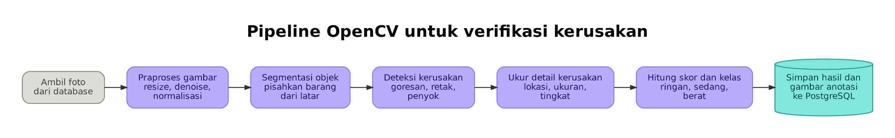

# Design Week 6 — Sistem Pengecekan Kerusakan Barang

## 1. Kebutuhan Terpilih

Fitur utama yang dipilih untuk dikembangkan adalah **pengecekan kondisi/kerusakan barang menggunakan image processing dan AI**.

Sistem menerima foto barang, kemudian memproses gambar untuk memverifikasi detail kerusakan. Hasil analisis digunakan untuk menentukan jenis, lokasi, ukuran/tingkat kerusakan, serta skor kondisi barang.

Kebutuhan utama:

- Pengguna dapat mengunggah foto barang.
- Sistem melakukan validasi kualitas foto.
- Sistem melakukan preprocessing gambar seperti resize, denoise, dan normalisasi.
- Sistem melakukan segmentasi untuk memisahkan objek barang dari latar belakang.
- OpenCV digunakan sebagai bagian dari pipeline image processing untuk membantu mendeteksi dan mengukur kerusakan.
- Model AI/machine learning digunakan untuk membantu klasifikasi/verifikasi kerusakan.
- Sistem menyimpan hasil analisis dan metadata ke PostgreSQL.
- Sistem menghasilkan skor dan kelas kerusakan: ringan, sedang, atau berat.
- Jika tingkat keyakinan hasil AI rendah, hasil diarahkan ke review manual petugas.


## 2. Asumsi

Beberapa asumsi yang digunakan dalam desain:

1. Foto barang tersedia dalam format yang dapat diproses oleh sistem.
2. Foto memiliki kualitas minimum yang cukup untuk dianalisis.
3. Jenis barang yang diperiksa termasuk dalam kategori yang telah didukung sistem.
4. Data gambar dan hasil analisis disimpan menggunakan PostgreSQL.
5. Model AI telah dilatih atau tersedia untuk mengenali pola kerusakan yang dibutuhkan.
6. Sistem memiliki batas confidence score untuk menentukan apakah hasil dapat diverifikasi otomatis.
7. Hasil dengan confidence rendah tidak langsung dianggap benar dan harus melalui review manual.
8. Petugas dapat melakukan verifikasi terhadap hasil yang membutuhkan pemeriksaan manual.


## 3. Daftar Modul dan Tanggung Jawab

| Modul -> Tanggung Jawab |
| Upload Foto - Menerima foto barang dari pengguna. |
| Validasi Foto - Memeriksa blur, pencahayaan, dan resolusi foto. |
| Penyimpanan Data - Menyimpan foto dan metadata ke PostgreSQL. |
| Preprocessing - Melakukan resize, denoise, dan normalisasi gambar. |
| Segmentasi Objek - Memisahkan objek barang dari latar belakang. |
| OpenCV / Image Processing - Memproses citra dan membantu mendeteksi serta mengukur detail kerusakan. |
| Model AI - Mengklasifikasikan/verifikasi jenis dan tingkat kerusakan berdasarkan hasil pemrosesan gambar. |
| Scoring | Menghitung skor dan menentukan kelas kerusakan ringan, sedang, atau berat. |
| Confidence Check - Memeriksa tingkat keyakinan hasil AI. |
| Verifikasi Manual - Memeriksa hasil yang confidence-nya rendah. |
| Notification / Result - Menampilkan hasil dan memberikan notifikasi kepada pengguna. |

## 4. Diagram Arsitektur

Diagram arsitektur menggambarkan pipeline utama pemrosesan gambar:

**Database → Preprocessing → Segmentasi → Deteksi → Pengukuran → Scoring → PostgreSQL**



File diagram:

- `docs/architecture.png`
- `docs/architecture-fitur.png` 

## 5. Label Hubungan dan Alur Satu Fitur

Fitur yang digunakan sebagai contoh adalah **pengecekan barang dengan AI**.

Alurnya:

1. **Pengguna unggah foto barang**
2. Sistem melakukan **validasi kualitas foto**.
3. Jika foto tidak memenuhi kualitas minimum, sistem **meminta pengguna mengunggah ulang foto**.
4. Jika foto valid, foto dan metadata **disimpan ke PostgreSQL**.
5. Sistem menjalankan **analisis OpenCV + model AI**.
6. Sistem menyimpan hasil analisis berupa **jenis, lokasi, dan skor kerusakan**.
7. Sistem memeriksa **confidence score**.
8. Jika confidence tinggi, hasil masuk ke **verifikasi otomatis**.
9. Jika confidence rendah, hasil masuk ke **review manual petugas**.
10. Hasil akhir dan notifikasi diberikan kepada pengguna.

### Kondisi Gagal

Kondisi gagal utama pada fitur ini adalah **foto tidak lolos validasi kualitas**.

Contohnya:

- Foto terlalu blur.
- Pencahayaan terlalu gelap/terang.
- Resolusi foto terlalu rendah.
- Objek barang tidak terlihat dengan jelas.

Ketika kondisi tersebut terjadi, sistem tidak melanjutkan analisis AI. Pengguna diminta mengunggah foto yang baru.

Kondisi gagal kedua adalah **confidence hasil AI rendah**. Dalam kondisi ini sistem tidak langsung memberikan hasil sebagai keputusan final, tetapi mengirim hasil ke petugas untuk review manual.

## 6. Dua Keputusan Desain dan Alasannya

### Keputusan Desain 1 — Menggunakan OpenCV sebagai Pipeline Image Processing

**Keputusan:** OpenCV digunakan untuk preprocessing, segmentasi, pendeteksian, dan pengukuran citra sebelum/bersama proses inferensi model AI.

**Alasan:**

- OpenCV menyediakan banyak fungsi computer vision yang sesuai dengan kebutuhan sistem.
- Preprocessing dapat dilakukan sebelum gambar diberikan ke model AI.
- Sistem dapat memperoleh informasi seperti lokasi dan ukuran kerusakan dari hasil pemrosesan citra.
- Pipeline menjadi lebih terstruktur karena proses gambar dipisahkan dari penyimpanan data dan antarmuka pengguna.

### Keputusan Desain 2 — Confidence Rendah Masuk Review Manual

**Keputusan:** Hasil AI dengan confidence score rendah tidak langsung dianggap sebagai hasil final.

**Alasan:**

- Foto barang dapat memiliki kondisi yang berbeda-beda.
- Kerusakan yang mirip atau kurang terlihat dapat menyebabkan AI salah melakukan klasifikasi.
- Review manual menjadi mekanisme fallback untuk mengurangi risiko keputusan otomatis yang salah.
- Sistem tetap dapat memanfaatkan AI untuk mempercepat pemeriksaan, tetapi keputusan yang kurang meyakinkan tetap dapat diverifikasi manusia.

## 7. Ringkasan Arsitektur

Secara keseluruhan, sistem menggunakan pendekatan **AI-assisted inspection**. Image processing digunakan untuk menyiapkan dan menganalisis gambar, model AI digunakan untuk membantu verifikasi kerusakan, dan PostgreSQL digunakan untuk menyimpan foto, metadata, serta hasil analisis.

Alur utama:

```text
Foto Barang
    ↓
Validasi Foto
    ↓
Preprocessing
    ↓
Segmentasi
    ↓
OpenCV + Model AI
    ↓
Deteksi & Pengukuran Kerusakan
    ↓
Scoring
    ↓
Confidence Check
    ├── Tinggi → Verifikasi Otomatis
    └── Rendah → Review Manual
                    ↓
             Hasil & Notifikasi
```
